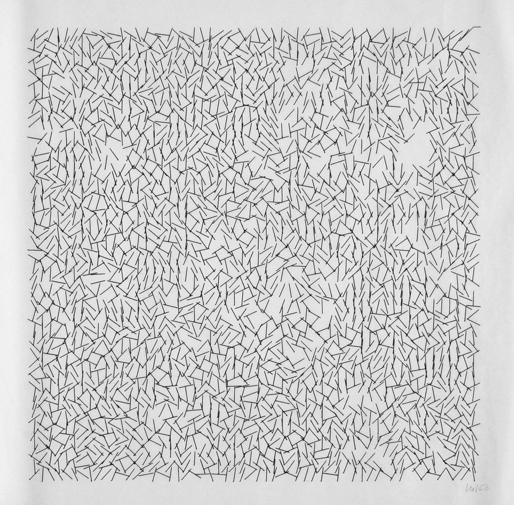

<!-- SVG transforms: rotate, translate, and scale -->

# Personal Toolbox - Recode _Interruptions_

    

In this series of assignments, you will be building your own library for drawing with SVG. This assignment extends your work in "Recode _Sainte-Victoire en Rouge_", "Recode _(Des)Ordres_", and "Recode _Schotter_", asking you to now implement programatic randomness and noise functions.

Your goal in this assignment is to write a program that generates an SVG file. This file should (to some reasonable degree) replicate [Interruptions](https://dam.org/museum/artists_ui/artists/molnar-vera/interruptions/) (1968-1969) by [Vera Molnar](https://dam.org/museum/artists_ui/artists/molnar-vera/).

To do this, you will need to implement reusable program components that can introduce randomness to some degree using one of the following methods:
- Random number generation
- Perlin noise
- Worley noise

Using your new randomness code, draw _Interruptions_ as an SVG file. Then, make one or more creative variations on _Interruptions_, experimenting with different levels of randomness or elements.

## Learning Goals
- Practice manipulating and transforming visual components.
- Practice writing reusable code components
- Expand and refactor your own library to incorporate composite components

## Deliverables
- An SVG file that replicates _Interruptions_.
- One or more SVG files that are variations on _Interruptions_.
- The program that generated the SVG files, containing your library (which should now be primitive components, path, polyline, group, transforms, and randomness).
- A README.md file that briefly explains how to run your program, where to find your new components, and any important design decisions you made.

> _All of the above should be committed to a GitHub repository; submit the URL of this repository._

## Grading Criteria

> _So long as you attend the critique, work may be redone and resubmitted for a higher grade._

<table>
    <tr>
        <td>A</td>
        <td>
            <li>Your recreation is accurate and thoughtfully done.</li>
            <li>Your variations are interesting and demonstrate creative risk-taking.</li>
            <li>Your components do their job and are used to create the artwork.</li>
            <li>Your readme is clear and sufficient.</li>
        </td>
    </tr>
    <tr>
        <td>B</td>
        <td><li>One of the required components is missing.</li></td>
    </tr>
    <tr>
        <td>C</td>
        <td><li>You did not participate in critique, or the work does not reflect your capacity.</li></td>
    </tr>
    <tr>
        <td>D</td>
        <td></td>
    </tr>
    <tr>
        <td>F</td>
        <td><li>Multiple components are missing entirely, the work is incomplete, or the work is clearly phoned in (well below your capacity).</li></td>
    </tr>
