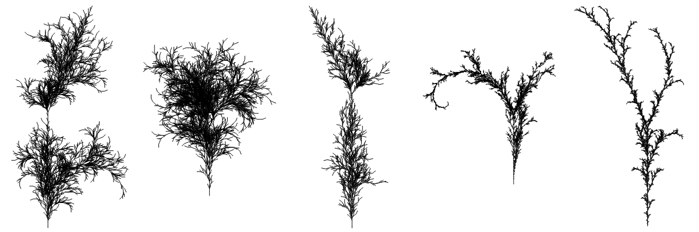

<!-- Generative Art using L-Systems -->

# Taking the L

    

Create a generative art piece using an L-system.

### Learning Goals:
- To experiment with and explore L-systems, a powerful generative algorithm for creating complex and interesting patterns.

### Deliverables:
1. A final generative art piece, generated using an L-system.
    - If you use HTML/JS, you may use either canvas or SVG (though continuing practice with SVG is encouraged)
2. The generative program, executable with basic instructions
3. A brief artist statement reflecting on the creative process and the aesthetic decisions made.

### Instructions:
1. Read up on the basic principles of L-systems and generative art.
    - [Wikipedia](https://en.wikipedia.org/wiki/L-system)
    - [The OG book](https://en.wikipedia.org/wiki/The_Algorithmic_Beauty_of_Plants)
2. Choose an L-system to use for your generative art piece.
    - You may choose a known example or create your own.
    - You should add some degree of sophistication to our basic L-system program. For example:
        - Adding a random component to the production rules, such that the resulting pattern is slightly different each time the program is run.
        - Adding a color scheme to the resulting pattern, such that different elements of the pattern are colored differently.
        - Adding overlapping production rules, such that the resulting pattern is more complex and layered.
        - Using interactive parameters to create a more dynamic and interactive program, such that the user can adjust certain variables and see how the resulting pattern changes.
        - Combining multiple L-systems to create a more complex and interesting generative art piece.
3. Write a program to produce strings with the chosen set of rules/alphabet/axiom, and then convert this string into a graphical form.
    - Your program should not immediately produce graphical effect from the rules themselves. It must produce a string first using the rules, and then convert this string into graphical form.
4. Your artwork should be visually interesting and engaging, should demonstrate creative risk-taking and artful effort, and be attractively presented within your chosen medium (screen, plot, etc).

### Grading Criteria:
<table>
    <tr>
        <td>A</td>
        <td>
            <li>The theme of the piece is clear and makes a poetic statement or inspires poetical thought.</li>
        </td>
    </tr>
    <tr>
        <td>B</td>
        <td><li>One of the required components is missing.</li></td>
    </tr>
    <tr>
        <td>C</td>
        <td><li>You did not participate in critique, or the work does not reflect your capacity.</li></td>
    </tr>
    <tr>
        <td>D</td>
        <td></td>
    </tr>
    <tr>
        <td>F</td>
        <td><li>Multiple components are missing entirely, the work is incomplete, or the work is clearly phoned in (well below your capacity).</li></td>
    </tr>
</table>

If a grade of C or lower is given, you may be given an opportunity to try again for full credit. However, I may then require you to start over with a brand new piece.
