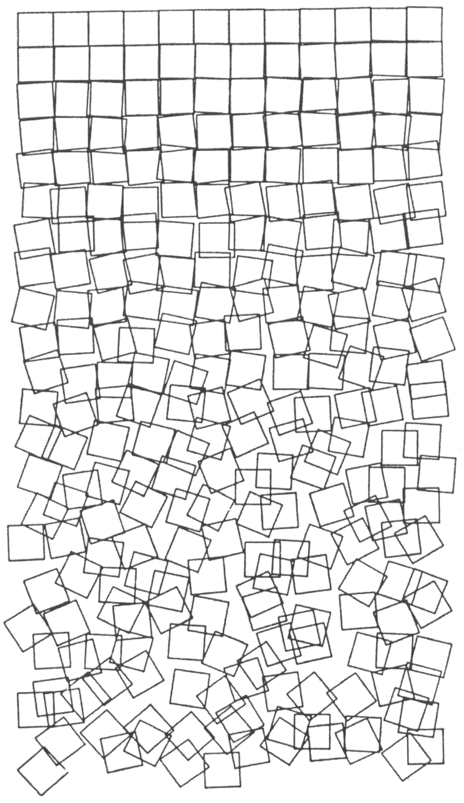

<!-- SVG transforms: rotate, translate, and scale -->

# Personal Toolbox - Recode _Schotter_

    

In this series of assignments, you will be building your own library for drawing with SVG. This assignment extends your work in "Recode _Sainte-Victoire en Rouge_" and "Recode _(Des)Ordres" , asking you to now implement representations of transforms: rotate, translate, and scale.

Your goal in this assignment is to write a program that generates an SVG file. This file should (to some reasonable degree) replicate [Schotter](http://www.medienkunstnetz.de/works/schotter/) (1968) by [Georg Nees](https://dam.org/museum/artists_ui/artists/nees-georg/).

To do this, you will need to implement reusable program components that can represent each of these SVG transforms:
- translate
- rotate
- scale

It should be possible to use your components to apply any of the above transforms to any representation of an SVG element, arbitrarily many times. Additionally, each transformation should "make sense" in its relationship to other transformations: rotating 30 degrees clockwise then rotating 30 degrees counterclockwise should result in no visual change, scaling up then scaling down by the same amount should result in no visual change, translating right by 30 then left by 40 should result in a visual move 10 to the left, etc.

Using your new transform code, draw _Schotter_ as an SVG file. Then, make one or more creative variations on _Schotter_, experimenting with different transforms or elements.

## Learning Goals
- Practice manipulating and transforming visual components.
- Practice writing reusable code components
- Expand and refactor your own library to incorporate composite components

## Deliverables
- An SVG file that replicates _Schotter_.
- One or more SVG files that are variations on _Schotter_.
- The program that generated the SVG files, containing your library (which should now be primitive components, path, polyline, group, and transforms).
- A README.md file that briefly explains how to run your program, where to find your new components, and any important design decisions you made.

> _All of the above should be committed to a GitHub repository; submit the URL of this repository._

## Grading Criteria

> _So long as you attend the critique, work may be redone and resubmitted for a higher grade._

<table>
    <tr>
        <td>A</td>
        <td>
            <li>Your recreation is accurate and thoughtfully done.</li>
            <li>Your variations are interesting and demonstrate creative risk-taking.</li>
            <li>Your components do their job and are used to create the artwork.</li>
            <li>Your readme is clear and sufficient.</li>
        </td>
    </tr>
    <tr>
        <td>B</td>
        <td><li>One of the required components is missing.</li></td>
    </tr>
    <tr>
        <td>C</td>
        <td><li>You did not participate in critique, or the work does not reflect your capacity.</li></td>
    </tr>
    <tr>
        <td>D</td>
        <td></td>
    </tr>
    <tr>
        <td>F</td>
        <td><li>Multiple components are missing entirely, the work is incomplete, or the work is clearly phoned in (well below your capacity).</li></td>
    </tr>

</table>

